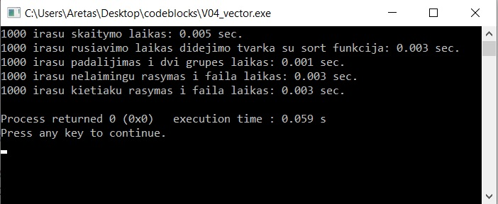
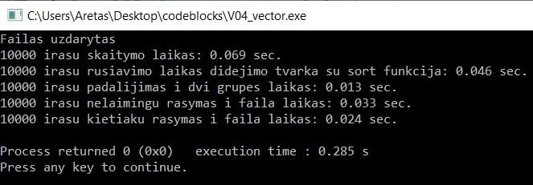
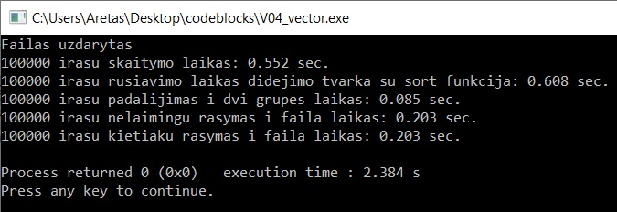
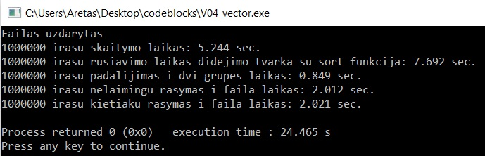

# 2uzduotis

## Versija v0.1

Paleidus programa vartotojas pasirenka kiek mokiniu duomenu jis ives. Tada prasoma ivesti pirmojo mokinio varda ir pavarde. Tada programa paklausia ar vartotojas nori, kad namu darbu rezultatus generuotu atsitiktinai ar ne. Tada atitinkamai varotojas eina prie tolesnio zingzio arba ivedineja namu darbu ivertinimus iki kol iveda -1. Tada iveda egzamino ivertinima arba jis sugeneruojamas atsitiktinai pagal pasirinkta varianta. Ir galiausiai programa paklausia vartotojo ar jis nori kad skaiciuotu namu darbu vidurki ar mediana. Tada galiausiai spausdinami rezultatai.

## Versija v0.2

Versijoje v0.2 galima pasirinkti ne tik ivesti duomenis ranka, bet ir skaityti juos is failo. Rezultatu faile ("kursiokai.txt") duomenys yra tvarkingai surikiuoti.

## Versija v0.3

Versijoje v0.3 struktūra bei funkcijos perkeltos į atskirą header failą, o pagrindinėje v0.3.cpp faile viršuje šis failas įterptas. Taip pat minimaliai pavartotas "exception handling(try, catch)" metodai. 

## Versija v0.4

Versijoje v0.4 yra sukuriami penki atsitiktiniai studentų sąrašai iš 1000, 10000, 100000, 1000000, 10000000 įrašų. Vardai ir Pavardės kuriami šabloniniai. Studenų sąrašai surūšiuojami į dvi kategorijas: studentai, kurių galutinis balas < 5.0 ir Studentai, kurių galutinis balas >= 5.0. Surūšiuoti studentai išvedami į du naujus failus. Programos vykdymo metu išmatuojama programos sparta išskiriant kiek laiko užtruko kiekvienas iš žemiau išvardintų žingsnių:
failų kūrimą;!
duomenų nuskaitymą iš failų;
studentų rūšiąvimą į dvi grupes/kategorijas;
surūšiuotų studentų išvedimą į du naujus failus.

## Versija v1.0

Šioje versijoje atliekami bandymai su tais pačiais duomenų tipais vector, deque ir list dvejomis strategijomis:
* 1 strategija: Bendro studentai konteinerio (vector, list ir deque tipų) skaidymas (rūšiavimas) į du naujus to paties tipo konteinerius: "vargšiukų" ir "kietiakų". Tokiu būdu tas pats studentas yra dvejuose konteineriuose: bendrame studentai ir viename iš suskaidytų (vargšiukai arba kietiakai).
* 2 strategija: Bendro studentų konteinerio (vector, list ir deque) skaidymas (rūšiavimas) panaudojant tik vieną naują konteinerį: "vargšiukai". Tokiu būdu, jei studentas yra vargšiukas, jį turime įkelti į naująjį "vargšiukų" konteinerį ir ištrinti iš bendro studentai konteinerio. Po šio žingsnio studentai konteineryje liks vien tik kietiakai.

