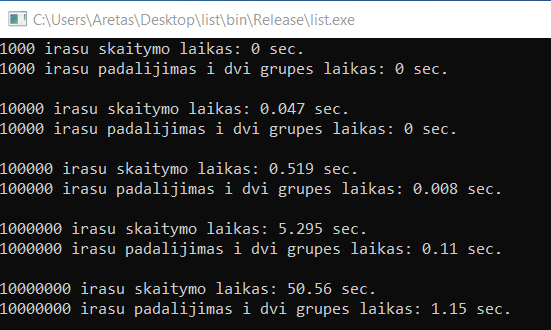

# 2uzduotis

## Versija v1.0

Šioje versijoje atliekami bandymai su tais pačiais duomenų tipais vector, deque ir list dvejomis strategijomis:
* 1 strategija: Bendro studentai konteinerio (vector, list ir deque tipų) skaidymas (rūšiavimas) į du naujus to paties tipo konteinerius: "vargšiukų" ir "kietiakų". Tokiu būdu tas pats studentas yra dvejuose konteineriuose: bendrame studentai ir viename iš suskaidytų (vargšiukai arba kietiakai).
* 2 strategija: Bendro studentų konteinerio (vector, list ir deque) skaidymas (rūšiavimas) panaudojant tik vieną naują konteinerį: "vargšiukai". Tokiu būdu, jei studentas yra vargšiukas, jį turime įkelti į naująjį "vargšiukų" konteinerį ir ištrinti iš bendro studentai konteinerio. Po šio žingsnio studentai konteineryje liks vien tik kietiakai.
* Pirmąją strategiją naudojant

* Antrąją strategiją naudojant

 
Rezultatai rodo, kad naudojant 1 strategiją deque ir vector duomenų tipa užtruko beveik tiek pat laiko, tačiau 

